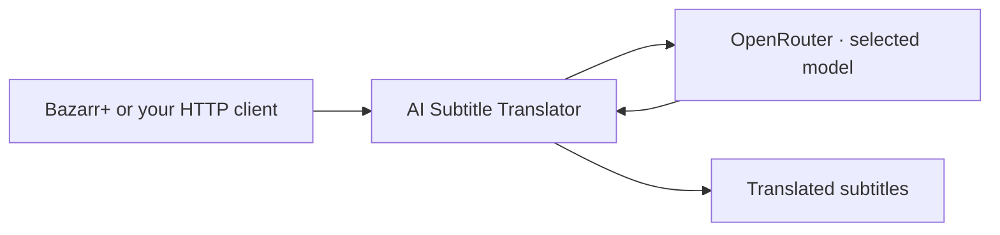

<picture>
  <source media="(max-width: 600px)" srcset="docs/assets/readme-hero-mobile.svg">
  
</picture>

# AI Subtitle Translator

**Built for [Bazarr+](https://github.com/LavX/bazarr). Ready for your own app.**

Translate SRT files and subtitle lines through OpenRouter. Run the service on your own machine, choose a model, and follow each job from submission to translated output.

[](https://github.com/LavX/ai-subtitle-translator/actions/workflows/ci.yml) [](pyproject.toml) [](LICENSE) [](https://github.com/sponsors/LavX)

**[Get started](#quick-start)** · **[Models & costs](#subtitle-translation-leaderboard)** · **[Web UI](#optional-web-ui)** · **[Use the API](#api-endpoints)** · **[Configuration](#configuration)**

- **SRT in, SRT out.** Subtitle files and right-to-left language support.
- **Choose your model.** OpenRouter models with per-request provider routing.
- **Track your jobs.** Immediate translation or queued jobs with progress and reported costs.

## What could a season cost?

The latest full-file run translated 1,340 cues with Luna for **$0.0466**. Scaling that result to 24 forty-minute episodes at 15 cues/minute gives roughly **$0.50 for one target language**. This is a budgeting estimate, not a measured season bill. [See the current results, formula and limits.](#episode-movie-and-season-cost-estimates)

## Quick start

### With Bazarr+

For the published image, run this on your Docker host:

```bash
curl -sSL https://raw.githubusercontent.com/LavX/ai-subtitle-translator/main/install.sh | bash
```

The installer detects containers named `bazarr` or `bazarr-ui-test`, configures networking and prints the encryption key.

1. Open **AI Subtitle Translator** settings in Bazarr+.
2. Enter a translator URL reachable from Bazarr+, the printed encryption key, your OpenRouter API key and an explicit model such as `openai/gpt-5.6-luna:smartfast` to match the benchmark routing.
3. Click **Test**, then **Save**.

On a shared custom Docker network, use `http://ai-subtitle-translator:8765`. Across separate bridge networks, use the Docker host's IP and published port. `localhost` works only when Bazarr+ shares the host network or runs directly on that host. See the [Bazarr+ Setup Guide](docs/BAZARR-SETUP.md).

### Docker

```bash
git clone https://github.com/LavX/ai-subtitle-translator.git
cd ai-subtitle-translator

# Set your OpenRouter API key and a recommended model
cat > .env <<'EOF'
OPENROUTER_API_KEY=sk-or-...
OPENROUTER_DEFAULT_MODEL=openai/gpt-5.6-luna:smartfast
EOF

docker compose up -d
```

Service runs at `http://localhost:8765`. Interactive docs at `/docs`. The named `translator-data` volume preserves the database and encryption key. Follow [Authentication](#authentication) before calling protected endpoints.

### Manual

```bash
git clone https://github.com/LavX/ai-subtitle-translator.git
cd ai-subtitle-translator
python -m venv venv && source venv/bin/activate
pip install -e .
export OPENROUTER_API_KEY=sk-or-...
export OPENROUTER_DEFAULT_MODEL=openai/gpt-5.6-luna:smartfast
mkdir -p data
export DB_PATH="$PWD/data/jobs.db"
export ENCRYPTION_KEY_FILE="$PWD/data/encryption.key"
uvicorn subtitle_translator.main:app --host 0.0.0.0 --port 8765
```

The source-build examples select Luna with local `:smartfast` routing on v2.0.0. See [model recommendations](#subtitle-translation-leaderboard) for quality, cost and compatibility notes.

## Optional web UI

Enable the standalone subtitle studio for single-file or batch SRT translation:

```dotenv
UI_ENABLED=true
```

Add that setting to `.env` for the supplied Compose setup, then run `docker compose up -d --build`. For a manual installation, export `UI_ENABLED=true` before starting the service. Open **http://localhost:8765/ui/**, or use your server's host name and port. The UI is disabled by default and adds no frontend build step or external CDN dependency.

1. Enter your **OpenRouter API key** and click **Connect**. No service token or encryption key is needed in the GUI. Connection checks use OpenRouter's [key endpoint](https://openrouter.ai/docs/api_reference/limits), without making a translation request.
2. Optionally select **Remember on this device** to save and reuse the validated key in this browser. **Forget saved key** removes it and disconnects. Unchecking Remember also removes the saved copy.
3. Add UTF-8 `.srt` files, choose the source and target languages, and select a model or enter a custom ID. Luna is preselected, with the full OpenRouter catalog available. Choose Lowest price (`:floor`, the default), Fastest (`:nitro`), SmartFast (price + speed), or OpenRouter default routing. **Service tier** starts at **Standard**, which keeps that routing preference while disabling automatic Flex and priority tier selection. **Follow routing** allows discounted Flex with `:floor` or priority capacity with `:nitro`. SmartFast uses standard capacity unless you explicitly choose another tier through a provider restriction or the API.
4. Translate the batch, follow each file's progress and reported cost, then download individual SRTs or the ready results as a ZIP.

The preview supports side-by-side comparison, subtitle italics/bold/underline, cue search, direct cue entry and keyboard navigation. Partial downloads show translated-cue coverage separately from completed batches. **Request options** sets a provider deadline of 2, 5 or 10 minutes; the UI starts at 2 minutes, and a request that stalls is retried once at the same size before the batch is split. A longer deadline gives slow routes more time, but does not guarantee provider availability. Flex capacity can be much slower or unavailable. Standard capacity can cost more than the catalog price and the [historical `:floor` estimates](docs/benchmarks/history.md#episode-movie-and-season-cost-estimates). See [OpenRouter service tiers](https://openrouter.ai/docs/guides/features/service-tiers) and [service compatibility](#subtitle-translation-leaderboard).

To select a specific provider, open **Request options** and enter its OpenRouter ID in **Provider**, for example `azure`. The request is restricted to that provider with fallbacks disabled, so it must serve the selected model. Leave it empty for automatic selection. Routing and tier settings still apply, but a tier-specific endpoint ID can change the eligible tier and price. This can help when one provider is slow, but does not guarantee availability.

**SmartFast** filters providers by price and estimated request time, then keeps each job with an eligible provider when possible. Selecting it reveals five controls in **Request options**: median premium (50%), speed tolerance (20%), sparse pool multiplier (3), maximum input price ($1 per million tokens), and maximum output price ($3 per million tokens). These are quoted rate limits, not a total bill budget. Cache hits and faster translations are not guaranteed. See [SmartFast routing](docs/smartfast.md) for selection rules, API examples and Bazarr+ model suffix usage. The full-file SmartFast benchmark below is separate from the historical routing comparisons.

**Reasoning** starts at **Off**, which explicitly disables reasoning for subtitle translation. **Model default** omits the setting, and catalog-supported effort levels are available when reported. A model that declares mandatory reasoning cannot use Off. Changing models keeps your explicit selection and explains incompatible choices before you submit. Custom model IDs remain usable with Off or Model default; the backend checks metadata when available.

The queue shows files awaiting submission, active jobs and downloadable outputs, with partial downloads counted separately. Job messages show the latest reported request, backoff and timeout recovery activity. Elapsed time and an accepted API key do not confirm translated output. If an older server has no activity detail, the UI says so. Terminal errors retain attempted and unattempted batch counts, including after restoring history.

GUI translations always use the OpenRouter key you entered. The GUI never falls back to the server's configured key. Its session shows only GUI jobs belonging to that key; people sharing a key share access to those jobs. Existing service-token API clients keep their authentication flow and do not list GUI jobs.

Remembering is opt-in and uses browser local storage, so save a key only on a trusted device. Without it, the browser keeps the key only for the current session. Disconnect clears the in-memory key; a saved key remains available until you forget it. Your key and subtitles pass through this self-hosted service to OpenRouter. Use HTTPS when accessing the service across an untrusted network.

Batch translation submits one job per file, not OpenRouter's asynchronous batch API. Queued and running jobs can be cancelled from the queue; a cancelled running job stops its provider requests and frees its worker. **Forget** removes a finished job and its result from the server. Partial results are marked and remain downloadable. The queue lists the newest event first: a job that just finished or a file you just added moves to the top. After a reload, the GUI restores retained jobs automatically when you connect with the same key. A remembered key reconnects automatically. Connection interruptions leave the last known progress visible while the GUI reconnects. Submissions are never automatically replayed.

The GUI is served by the application. Its Python controller calls the job manager directly, using one same-origin `/ui/session` WebSocket for browser commands and live updates. Browser state is plain JSON, with no custom encryption layer. Reverse proxies must forward WebSocket upgrades. Queued cancellation preserves results if a job finishes before the command arrives. Existing HTTP API clients remain supported. Per-job keys use the service's existing encryption at rest. If encryption is disabled, keys are not persisted, and interrupted GUI jobs fail after a restart instead of using the server's key.

## Authentication

Encryption is enabled by default. Translation, job, configuration and status endpoints require an `X-Auth-Token` derived from the shared encryption key. Bazarr+ handles this automatically after you configure that key.

For the Docker setup, derive a token without copying the encryption key into your shell:

```bash
AUTH_TOKEN=$(docker exec ai-subtitle-translator python -c '
import hashlib, hmac, os
from pathlib import Path
key = os.environ.get("ENCRYPTION_KEY") or Path(
    os.environ.get("ENCRYPTION_KEY_FILE", "/app/data/encryption.key")
).read_text().strip()
print(hmac.new(bytes.fromhex(key), b"subtitle-translator-auth-v1", hashlib.sha256).hexdigest())
')

curl -H "X-Auth-Token: $AUTH_TOKEN" http://localhost:8765/api/v1/status
```

For a manual installation, run the same Python command without `docker exec ai-subtitle-translator`, in the shell where you exported `ENCRYPTION_KEY_FILE`.

`/health`, `/api/v1/models`, `/docs`, `/redoc` and `/openapi.json` are public. `PUT /api/v1/config` also requires `X-Admin-Key` when `ADMIN_API_KEY` is set. Disabling encryption skips token authentication; a configured admin key still protects configuration writes.

<details>
<summary>Encrypted API keys, key rotation and disabling encryption</summary>

### API key encryption

API keys sent between clients and the translator can be encrypted in transit using AES-256-GCM with a pre-shared key. This protects the API-key field only; subtitle text and the authentication token still need HTTPS when crossing an untrusted network.

### How it works

1. On first startup, the translator generates an encryption key and saves it to `/app/data/encryption.key`
2. Read the key: `docker exec ai-subtitle-translator cat /app/data/encryption.key`
3. Paste the 64-character hex key into Bazarr+'s AI Subtitle Translator settings
4. Bazarr+ encrypts the OpenRouter API key before sending it in requests
5. The translator decrypts it on receipt
6. The same key is used to derive the auth token (see [Authentication](#authentication))

Encrypted API keys use the format `enc:base64data`. Plaintext keys are accepted by default. Set `ENCRYPTION_STRICT=true` to require encrypted per-request keys on translation endpoints. The current `/test` and `PUT /config` handlers do not enforce this check.

### Test encryption

```bash
curl -X POST http://localhost:8765/api/v1/test \
  -H "Content-Type: application/json" \
  -H "X-Auth-Token: YOUR_AUTH_TOKEN" \
  -d '{"apiKey": "enc:your-encrypted-key-here"}'
```

Returns encryption status and OpenRouter API key validation in one call.

### Regenerate key

```bash
# Via CLI (inside container)
docker exec ai-subtitle-translator python -m subtitle_translator.cli regenerate-key

# Or set via environment variable (overrides key file)
docker run -e ENCRYPTION_KEY=your64charhexkey... ...
```

Restart the service after changing the key file and update clients to use the new key. Existing persisted per-request keys encrypted with the old key cannot be decrypted with the new one.

### Disable encryption

```bash
docker run -e ENCRYPTION_ENABLED=false ...
```

</details>

## Subtitle translation leaderboard

**Start with Luna on SmartFast.** In the September 10, 2026 full-file English-to-Hungarian run, Luna tied Gemini 3.1 Flash Lite for the highest sampled quality and cost less, with a similar completion time. Muse Spark 1.3 placed next on sampled quality but took much longer; Muse 1.2 offers a cheaper, faster alternative to it. Mercury was fast and inexpensive, but frequent malformed Hungarian lowered its score.

**10 of 16 models returned all 1,340 cues.** Every model below was tested on commit `f80a190`, the build that became v2.0.0, through the actual 2.0.0 queued API with OpenRouter SDK 1.1.133. No older results fill gaps in this comparison.

| Model ID | Result | Progress / 1,340 | Seconds | Observed cost, USD | Quality / 100 | Reviewed / 180 |
| --- | --- | ---: | ---: | ---: | ---: | ---: |
| `openai/gpt-5.6-luna` | Complete | 1340 | 45.581 | $0.046563 | 93 | 180 |
| `google/gemini-3.1-flash-lite` | Complete | 1340 | 41.820 | $0.083729 | 93 | 180 |
| `meta/muse-spark-1.3-contributor` | Complete | 1340 | 376.741 | $0.018895 | 91 | 180 |
| `meta/muse-spark-1.2-contributor` | Complete | 1340 | 126.772 | $0.017770 | 89 | 180 |
| `google/gemini-3.5-flash-lite` | Complete | 1340 | 40.496 | $0.120194 | 84 | 180 |
| `z-ai/glm-5.3-flash` | Complete | 1340 | 501.726 | $0.117077† | 81 | 180 |
| `openai/gpt-4o-mini` | Complete | 1340 | 131.258 | $0.027982 | 81 | 180 |
| `google/gemini-2.5-flash-lite` | Complete | 1340 | 45.534 | $0.021060 | 80 | 180 |
| `inception/mercury-2.5` | Complete | 1340 | 50.856 | $0.013707 | 70 | 180 |
| `qwen/qwen3.7-flash` | Complete | 1340 | 564.744 | $0.020150 | 58 | 180 |
| `deepseek/deepseek-v4-flash-0731` | 600s cap | 400 | 600.007 | $0.081432† | 87* | 50 |
| `qwen/qwen3.8-flash` | 600s cap | 1000 | 600.125 | $0.069066† | 79* | 144 |
| `liquid/lfm-2.5-2.6b:free` | 600s cap | 700 | 600.094 | $0.000000† | 29* | 125 |
| `inclusionai/ling-3.0-flash-fin:free` | Failed | 0 | 96.436 | unknown | N/A | 0 |
| `nvidia/nemotron-3.5-lightning:free` | 600s cap | 0 | 600.099 | unknown | N/A | 0 |
| `dots-studio/dots-3-note-preview:free` | Failed | 0 | 6.684 | $0.000000 (no requests) | N/A | 0 |

All complete files returned 1,340 cues with preserved indices and timestamps. Failed and capped jobs returned no subtitle file; progress counts settled work, not delivered output. **\* Provisional fragment score:** only available sampled cues were reviewed, so these scores are excluded from the ranking. **† Cost lower bound:** some requests lacked usage. Total observed charges were **$0.63762675**, with **39 requests missing cost values**.

### How this was measured

All 16 jobs launched in parallel using Bazarr+ compatible encrypted requests, with 100-cue batches and four parallel batches per model. Each job had a ten-minute wall-clock cap and a 600-second request timeout. Temperature was configured as 0.3, omitted for Luna because unsupported; reasoning was unspecified. The harness used the service API, not a running Bazarr+ client.

SmartFast checked endpoint prices before routing, excluded expensive outliers, and preferred lower prices within a 20% estimated speed band. The run used median +50% and sparse-pool 3× price filters, $1 input / $3 output per million token ceilings, and exact zero caps for free models. Stable sessions and provider affinity support caching. All 284 forwarded requests passed price, session and payload checks; all 15 admitted models passed the initial endpoint-selection audit. Advertised speed and session affinity do not guarantee the fastest actual response. See the [SmartFast guide](docs/smartfast.md) for configuration.

Quality used a fixed, blinded **180-cue sample per complete file**: twelve evenly spaced 12-cue scenes and 36 thematic cues, selected before output arrived. The automated editorial rubric weights meaning 50%, semantic completeness 20%, Hungarian fluency/register 20%, and terminology 10%. Each model had one primary reviewer with targeted context checks. Scores are subjective judgments, not accuracy percentages; small differences are not statistically established. Every available cue also received mechanical checks for structure, unchanged text, line length and reading speed. This was not a full-file semantic review.

The incomplete runs had different causes: **Dots** had no eligible healthy endpoint; **Ling** returned 14 upstream HTTP 404 errors; **Nemotron** sent headers and whitespace keepalives without completed response bodies. **DeepSeek**, **Qwen 3.8** and **Liquid** returned partial work but missed the deadline. Native JSON support was optional for these routes. See the [routing and stall diagnosis](docs/benchmarks/2026-09-10-smartfast-full-quality-diagnosis.md) for receipts and reasoning-token counts.

### Episode, movie and season cost estimates

For a rough Luna budget, scale its measured **$0.046563165 per 1,340 cues** by your file’s cue count. At an illustrative 15 cues/minute, a 20-minute episode is about **$0.0104**, a two-hour movie **$0.0625**, and 24 forty-minute episodes **$0.5004**. These are extrapolations from this one SmartFast run, not measured season bills. Text density, reasoning, provider prices, retries and cache usage can change costs. Time does not scale linearly because batches run in parallel.

```text
estimated Luna cost = 0.046563165 × your cue count / 1340
```

### Raw results and earlier runs

- [Complete run report](docs/benchmarks/2026-09-10-smartfast-full-quality-report.md) and [CSV](docs/benchmarks/2026-09-10-smartfast-full-quality.csv), including requests, tokens, cache usage and returned-cue counts.
- [Quality findings](docs/benchmarks/2026-09-10-smartfast-full-quality-quality.md), including the mechanical checks, and the [quality CSV](docs/benchmarks/2026-09-10-smartfast-full-quality-quality.csv).
- The price preflight, endpoint metrics and verification records for this run are not kept in the repository. The figures taken from them are in the report and the CSVs above; the raw captures were several megabytes of JSON that nothing read.
- [Historical benchmarks](docs/benchmarks/history.md): September 7 smoke tests and September 9 routing/retry runs, with their original settings and limitations.

## How it fits together



The service handles batching, retries and queued-job progress. OpenRouter routes model inference. Job history lives in SQLite; review the [restart and recovery limits](#job-persistence) before relying on unattended workloads.

## API endpoints

Full interactive docs at `/docs` (Swagger) or `/redoc` when running. File endpoints accept JSON with a `content` string containing SRT text, not multipart uploads. Content endpoints accept a `lines` array.

| Method | Endpoint | Auth | Description |
|--------|----------|------|-------------|
| `GET` | `/health` | | Health check |
| `GET` | `/api/v1/models` | | List recommended translation models and metadata |
| `GET` | `/api/v1/status` | token | Service status and queue stats |
| `GET` | `/api/v1/config` | token | Current configuration |
| `PUT` | `/api/v1/config` | token | Update config at runtime |
| `POST` | `/api/v1/translate/content` | token | Translate subtitle lines (synchronous) |
| `POST` | `/api/v1/translate/file` | token | Translate SRT file (synchronous) |
| `POST` | `/api/v1/jobs/translate/content` | token | Submit async translation job |
| `POST` | `/api/v1/jobs/translate/file` | token | Submit async SRT translation job |
| `GET` | `/api/v1/jobs` | token | List all jobs (filter by status) |
| `GET` | `/api/v1/jobs/{id}` | token | Job status, progress, metrics, and result |
| `DELETE` | `/api/v1/jobs/{id}` | token | Cancel a queued job or delete a finished job |
| `POST` | `/api/v1/test` | token | Test encryption and API key validity |

Endpoints marked **token** require an `X-Auth-Token` header when encryption is enabled (see [Authentication](#authentication)).

### Translate subtitle content

```bash
curl -X POST http://localhost:8765/api/v1/translate/content \
  -H "Content-Type: application/json" \
  -H "X-Auth-Token: $AUTH_TOKEN" \
  -d '{
    "sourceLanguage": "en",
    "targetLanguage": "hu",
    "title": "Breaking Bad",
    "lines": [
      {"position": 1, "line": "Say my name."},
      {"position": 2, "line": "You are goddamn right."}
    ]
  }'
```

### Submit async translation job

```bash
curl -X POST http://localhost:8765/api/v1/jobs/translate/content \
  -H "Content-Type: application/json" \
  -H "X-Auth-Token: $AUTH_TOKEN" \
  -d '{
    "sourceLanguage": "en",
    "targetLanguage": "hu",
    "title": "Breaking Bad S05E07",
    "mediaType": "Episode",
    "fileName": "breaking.bad.s05e07.srt",
    "jobName": "bb-s05e07-hungarian",
    "lines": [
      {"position": 1, "line": "Say my name."}
    ],
    "config": {
      "model": "openai/gpt-5.6-luna:smartfast",
      "temperature": 0.3,
      "reasoning": {"effort": "low"},
      "parallelBatches": 4
    }
  }'
```

<details>
<summary>Example job status and cancellation behavior</summary>

### Job status response

Poll `GET /api/v1/jobs/{id}` for live progress and metrics:

```json
{
  "jobId": "3f1318c0-...",
  "status": "processing",
  "progress": 66,
  "message": "Translated 400/600 lines (4/6 batches)",
  "jobName": "bb-s05e07-hungarian",
  "fileName": "breaking.bad.s05e07.srt",
  "sourceLanguage": "en",
  "targetLanguage": "hu",
  "title": "Breaking Bad S05E07",
  "mediaType": "Episode",
  "model": "openai/gpt-5.6-luna:smartfast",
  "totalLines": 600,
  "totalBatches": 6,
  "completedBatches": 4,
  "completedLines": 400,
  "tokensUsed": 25000,
  "totalCost": 0.0084,
  "elapsedSeconds": 12.5
}
```

Job statuses: `queued` | `processing` | `completed` | `partial` | `failed` | `cancelled`

Processing jobs cannot currently be cancelled. Deleting a processing job returns its current status without stopping translation. A `partial` result includes translated lines and original text for lines that could not be translated.

</details>

### Per-request config override

Every translate endpoint accepts an optional `config` block to override defaults:

```json
{
  "config": {
    "apiKey": "sk-or-different-key",
    "model": "deepseek/deepseek-v4-flash-0731:floor",
    "temperature": 0.5,
    "parallelBatches": 2,
    "reasoning": {"effort": "low"},
    "provider": {"sort": "floor"}
  }
}
```

Reasoning effort levels: `xhigh`, `high`, `medium`, `low`, `minimal`, `none`. The `none` value explicitly disables reasoning. Omitting reasoning settings retains model defaults.

Provider routing (`provider.sort`) decides which OpenRouter provider serves the model:

| Value | What is sent | Effect |
| --- | --- | --- |
| `throughput` (default when nothing is sent) | `provider.sort: throughput` | Fastest provider first |
| `price` | `provider.sort: price` | Cheapest provider first |
| `latency` | `provider.sort: latency` | Lowest latency first |
| `nitro` | `model:nitro` slug shortcut | Fastest, and priority-tier endpoints become eligible |
| `floor` | `model:floor` slug shortcut | Cheapest, and flex-tier endpoints become eligible |
| `smartfast` | Filtered `provider.only`, mandatory `max_price`, and `session_id` | Price limits, estimated speed and affinity for each job; see [SmartFast](docs/smartfast.md) |
| `default` | nothing | OpenRouter's own load balancing |

`nitro` and `floor` are supersets of the matching sort. OpenRouter does not stack slug variants, so on a slug that already carries one (`:thinking`, `:free`, ...) they fall back to the plain `throughput`/`price` sort. A `:nitro` or `:floor` typed straight into the model id is honoured as-is and no competing sort is sent. For these existing routes, `provider.order`, `only`, `ignore` and `allowFallbacks` are passed through unchanged.

SmartFast accepts `config.provider.sort: "smartfast"` or a trailing `:smartfast` on the model ID. The translator removes that local suffix before calling OpenRouter and preserves underlying variants, including `model:free:smartfast` and `model:thinking:smartfast`. Tune it with `config.provider.smartFast`; the [SmartFast guide](docs/smartfast.md) lists all fields and bounds. Manual provider order, stacked routing shortcuts and a competing sort are rejected. Explicit `only`, `ignore` and `allowFallbacks: false` restrictions remain effective within SmartFast's limits.

Per-request `config.serviceTier` accepts `default` (standard capacity), `flex`, or `priority`. It is forwarded as OpenRouter's top-level `service_tier`. Setting `default` prevents route shortcuts from admitting Flex and priority tiers, while retaining their price or throughput sorting. Outside SmartFast, omitting it preserves OpenRouter's routing-based tier selection. SmartFast uses standard endpoints when it is omitted, unless an explicit `only` restriction selects another tier. The GUI explicitly selects standard capacity for new submissions; existing API clients retain their current behavior.

## Configuration

The table lists application defaults. For manual runs, most settings load from environment variables or a `.env` file in the working directory. `LOG_LEVEL` and `CORS_ALLOWED_ORIGINS` read the process environment directly: export them for manual runs. Docker Compose only forwards the variables explicitly listed in `docker-compose.yml`; add other settings to its `environment` section. Its default model is `google/gemini-2.5-flash-preview-09-2025`, which differs from the application default below. Set a model ID available to your OpenRouter account explicitly.

| Variable | Default | Description |
|----------|---------|-------------|
| `OPENROUTER_API_KEY` | *(empty)* | Default OpenRouter API key; required for translation unless supplied in request config |
| `OPENROUTER_DEFAULT_MODEL` | `amazon/nova-2-lite-v1:free` | Default translation model |
| `OPENROUTER_TEMPERATURE` | `0.3` | Sampling temperature |
| `BATCH_SIZE` | `100` | Max subtitle lines per batch (auto-adjusted per model) |
| `PARALLEL_BATCHES_PER_JOB` | `4` | Concurrent batches per translation job |
| `JOB_QUEUE_MAX_CONCURRENT` | `15` | Concurrent translation job workers at startup |
| `JOB_QUEUE_MAX_JOBS` | `500` | Maximum queued and processing jobs accepted; existing active jobs are retained after a lower limit is configured |
| `RETRY_DELAY` | `1.0` | Base delay in seconds for ordinary retries |
| `MAX_RETRIES` | `3` | Ordinary retry setting; repeated 429s use up to `MAX_RETRIES + 3` attempts |
| `REQUEST_TIMEOUT` | `120.0` | Provider request timeout in seconds; each root batch has a budget of three times this value including one same-size retry and recovery |
| `LOG_LEVEL` | `INFO` | Log level (`DEBUG` for full request/response logging) |
| `CORS_ALLOWED_ORIGINS` | `*` | Comma-separated allowed CORS origins |
| `ADMIN_API_KEY` | *(empty)* | Required as `X-Admin-Key` header for PUT /config when set |
| `UI_ENABLED` | `false` | Serve the optional web UI at `/ui/` |
| `HOST` | `0.0.0.0` | Bind address when launched with `python -m subtitle_translator.main` |
| `PORT` | `8765` | Port when launched with `python -m subtitle_translator.main` |
| `ENCRYPTION_ENABLED` | `true` | Enable AES-256-GCM API key encryption |
| `ENCRYPTION_STRICT` | `false` | When true, reject plaintext API keys (require enc: prefix) |
| `ENCRYPTION_KEY` | *(auto-generated)* | 64-char hex AES-256 key. Overrides key file when set |
| `ENCRYPTION_KEY_FILE` | `/app/data/encryption.key` | Path to persistent encryption key file |
| `DB_PATH` | `/app/data/jobs.db` | SQLite database path for job persistence |
| `JOB_RETENTION_HOURS` | `24` | Hours to keep completed/failed jobs before cleanup |

The Docker image and manual Uvicorn command above explicitly bind to `0.0.0.0:8765`. Change the Uvicorn arguments to use another bind address or port.

`PUT /api/v1/config` changes are held in memory and lost on restart. Running jobs keep the model, temperature, parallel batch count and API key defaults captured when they started. Queued jobs use current defaults when they start; explicit request overrides retain priority. API key rotation updates subsequent requests without closing connections used by running jobs. See the interactive schema for accepted fields.

A provider timeout is retried once at the same size, because a stalled request usually means a slow provider rather than an oversized batch, and a stall does not teach the model a smaller batch size. If the retry also times out, the batch is split once above the five-line floor. A timed-out floor batch or recovery request is not repeated. The root batch, including the retry and recovery, has a budget of three times the configured request timeout. Up to `PARALLEL_BATCHES_PER_JOB` batches are in flight at once, and a batch that finishes frees its slot for the next one immediately, so one stalled request no longer holds back the other slots. A parallel group that produces no usable output and only timeout failures stops later groups; earlier translations and reported usage remain available. Ordinary invalid-response, network and rate-limit errors keep their distinct retry handling within the batch budget. Per-request `config.requestTimeout` overrides the timeout (30-900 seconds).

Small models are loose with JSON. A trailing comma is repaired, and a reply cut off by the token limit keeps the complete translations before the break, and only the cues it left out are requested again. One malformed line no longer costs the lines behind it: when a batch is split, every smaller batch is still attempted after one of them fails, and the result names the cues that stayed in the source language and why.

OpenRouter can return HTTP 200 with an error inside the response body. The service handles those errors by their embedded code: rate limits wait before retrying and do not reduce batch size; transient server errors use bounded retries; authentication and credit errors fail the batch. Reported usage from failed attempts remains included. A provider error marker cannot count as a completed translation.

Job messages publish request, retry, backoff and recovery activity while work is pending. Activity does not advance completed line/batch counts or invent usage. Partial adaptive output retains translated indices while missing positions use source-text fallbacks in downloadable results. Every request line carrying a translated position counts as completed; a reply that repeats an index or answers one nobody asked for adds nothing.

## Job persistence

Jobs are stored in SQLite and survive container restarts. On startup, queued or in-progress jobs from the previous session are recovered and re-queued from the beginning; completed batches are not checkpointed for resumption. Per-request API keys are encrypted at rest when encryption is enabled. With encryption disabled, those keys are not persisted, so recovery requires a configured default API key.

Startup recovers every stored queued or processing job independently of recent terminal history. History loaded into memory is bounded by `JOB_QUEUE_MAX_JOBS`. If that limit has decreased below the accepted active count, existing work is retained and new submissions wait until the active count falls below the limit.

Mount a volume to `/app/data` to persist across container recreations:

```bash
docker run -d --name ai-subtitle-translator \
  -p 8765:8765 \
  -v translator-data:/app/data \
  -e OPENROUTER_API_KEY=sk-or-... \
  -e OPENROUTER_DEFAULT_MODEL=openai/gpt-5.6-luna:floor \
  ghcr.io/lavx/ai-subtitle-translator:latest
```

The data directory contains:

- `jobs.db` - SQLite database with all job history
- `encryption.key` - auto-generated encryption key (chmod 600)

<details>
<summary>Adaptive batch sizing, rate limits and reasoning controls</summary>

## Adaptive batch sizing

Batch size depends on the model and its output limits. The translator adjusts it using:

1. **Known limits** - small-context models get smaller default batches
2. **Context-length heuristic** - estimates safe batch size from the model's context window
3. **Adaptive retry** - if a batch fails, halves the size and retries, down to five lines. Remembers the learned size for future requests to the same model. After three consecutive qualifying successes, doubles it toward the size that originally failed. This state is in memory and resets on restart.

Batch sizing helps with incomplete responses and context limits, but does not guarantee a model will produce valid translations.

## Rate limit handling

When OpenRouter returns 429 Too Many Requests:

- Makes up to six attempts for repeated 429s with default settings. Honors `Retry-After` when provided; otherwise backoff starts at five seconds and caps at 30 seconds
- Serializes retries across parallel batches so they don't all hit the API at once
- Staggers initial parallel requests by 0.5s to spread the load
- Reports `partial` status if some batches completed before retries ran out

## Reasoning support

Reasoning configuration uses explicit catalog effort metadata when available, then falls back to built-in model overrides and recommended-model metadata. Other model IDs use the OpenRouter `/models` API. When reasoning is requested:

- For effort-based models, the service forwards the requested effort, for example `{"reasoning": {"effort": "low"}}`
- When the catalog declares supported efforts, an explicit effort is forwarded unchanged or rejected before a translation request if unsupported. This metadata takes priority over older token-budget model overrides. Without effort metadata, token-budget models accept `{"reasoning": {"maxTokens": N}}`; an `effort` value alone keeps the existing fallback behavior
- `effort: "none"` or `enabled: false` sends `reasoning: {"effort": "none"}` to OpenRouter. Omitted reasoning settings retain model defaults. Models declaring mandatory reasoning in `/models` metadata reject explicit disable before a translation request is sent. Disable also conflicts with an explicitly selected thinking variant.
- `response_format: json_object` is sent when reasoning is omitted or explicitly disabled. SmartFast also requires every endpoint allowed for that request to support this optional field, otherwise it omits the field and keeps the same JSON instructions, cue validation and bounded recovery. JSON mode only allows an object at the top level, so the prompt asks for `{"translations": [...]}`; asking for a bare array under JSON mode made some models (DeepSeek V4 Flash among them) answer with a single translated line per batch. The parser also accepts a wrapper under any single list-valued key.
- `response_format: json_object` is skipped when reasoning is enabled (some models misbehave with reasoning and JSON mode together)

</details>

## Development

Open feature and fix pull requests against `development`, the pre-release branch. `main` is the stable branch.

```bash
pip install -e ".[dev]"
pytest tests/ -v --tb=short # unit and integration tests
ruff check src/ tests/    # lint
ruff format src/ tests/   # format
```

The optional UI has dependency-free JavaScript checks:

```bash
node --test tests/ui/*.test.mjs
```

For browser acceptance checks, install Playwright in your development environment:

```bash
pip install playwright
playwright install chromium
PYTHONPATH=src python tests/ui_browser.py
```

This starts a temporary local service using the real API and job worker with synthetic translations and dummy OpenRouter key validation. It makes no paid model calls. The checks cover key saving and reuse, job ownership, batch downloads, partial results, cancellation races and interrupted submissions. Set `CHROMIUM_PATH` to use a particular Chromium executable.

## Project structure

```
src/subtitle_translator/
  main.py                 # FastAPI application
  config.py               # Settings from environment variables
  crypto.py               # AES-256-GCM encryption and key management
  cli.py                  # CLI commands (key regeneration)
  web.py                  # Optional static UI routes
  gui.py                  # App-owned browser commands and live job updates
  ui_api.py               # OpenRouter key authentication and GUI job ownership
  static/                 # Browser workspace and ZIP download helper
  api/
    routes.py             # REST API endpoints
    models.py             # Pydantic request/response models
  core/
    translator.py         # Translation orchestration
    srt_parser.py         # SRT file parsing and composing
    batch_processor.py    # Parallel batch processing with adaptive retry
    batch_sizing.py       # Per-model batch size resolution
  providers/
    base.py               # Abstract translation provider interface
    openrouter.py         # OpenRouter API implementation
  queue/
    job_manager.py        # Async job queue with progress tracking
    job_store.py          # SQLite persistence layer
    worker.py             # Background job worker
```

## License

MIT. See [LICENSE](LICENSE).

## Built alongside Bazarr+

- [LavX](https://lavx.hu) - Enterprise AI solutions
- [Bazarr+](https://github.com/LavX/bazarr) - Subtitle management, translation and the wider media workflow
- [OpenRouter](https://openrouter.ai/) - Multi-model LLM routing API

If this service makes your library more accessible, [support its development](https://github.com/sponsors/LavX).
