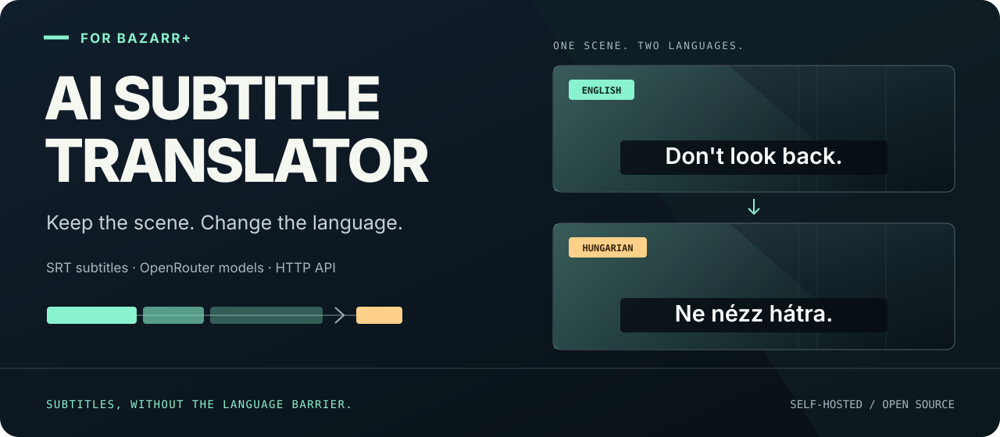
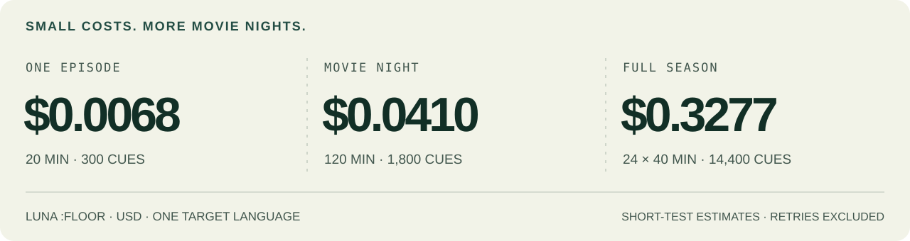
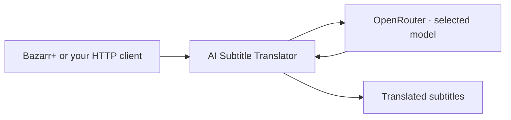

<picture>
  <source media="(max-width: 600px)" srcset="docs/assets/readme-hero-mobile.svg">
  
</picture>

# AI Subtitle Translator

**Built for [Bazarr+](https://github.com/LavX/bazarr). Ready for your own app.**

Translate SRT files and subtitle lines through OpenRouter. Run the service on your own machine, choose a model, and follow each job from submission to translated output.

[](https://github.com/LavX/ai-subtitle-translator/actions/workflows/ci.yml) [](pyproject.toml) [](LICENSE) [](https://github.com/sponsors/LavX)

**[Get started](#quick-start)** · **[Models & costs](#subtitle-translation-leaderboard)** · **[Use the API](#api-endpoints)** · **[Configuration](#configuration)**

- **SRT in, SRT out.** Subtitle files and right-to-left language support.
- **Choose your model.** OpenRouter models with per-request provider routing.
- **Track your jobs.** Immediate translation or queued jobs with progress and reported costs.

## What could a season cost?

<picture>
  <source media="(max-width: 600px)" srcset="docs/assets/readme-costs-mobile.svg">
  
</picture>

**Illustrative costs, not full-movie measurements.** These use our September 7, 2026 English-to-Hungarian sample, Luna's `:floor` route and 15 cues per minute. One target language; retries excluded. [See every episode/season scenario, model comparison and limitation.](#episode-movie-and-season-cost-estimates)

## Quick start

### With Bazarr+

Run this on your Docker host:

```bash
curl -sSL https://raw.githubusercontent.com/LavX/ai-subtitle-translator/main/install.sh | bash
```

The installer detects containers named `bazarr` or `bazarr-ui-test`, configures networking and prints the encryption key.

1. Open **AI Subtitle Translator** settings in Bazarr+.
2. Enter a translator URL reachable from Bazarr+, the printed encryption key, your OpenRouter API key and an explicit model such as `google/gemini-3.1-flash-lite:floor`.
3. Click **Test**, then **Save**.

On a shared custom Docker network, use `http://ai-subtitle-translator:8765`. Across separate bridge networks, use the Docker host's IP and published port. `localhost` works only when Bazarr+ shares the host network or runs directly on that host. See the [Bazarr+ Setup Guide](docs/BAZARR-SETUP.md).

### Docker

```bash
git clone https://github.com/LavX/ai-subtitle-translator.git
cd ai-subtitle-translator

# Set your OpenRouter API key and a recommended model
cat > .env <<'EOF'
OPENROUTER_API_KEY=sk-or-...
OPENROUTER_DEFAULT_MODEL=google/gemini-3.1-flash-lite:floor
EOF

docker compose up -d
```

Service runs at `http://localhost:8765`. Interactive docs at `/docs`. The named `translator-data` volume preserves the database and encryption key. Follow [Authentication](#authentication) before calling protected endpoints.

### Manual

```bash
git clone https://github.com/LavX/ai-subtitle-translator.git
cd ai-subtitle-translator
python -m venv venv && source venv/bin/activate
pip install -e .
export OPENROUTER_API_KEY=sk-or-...
export OPENROUTER_DEFAULT_MODEL=google/gemini-3.1-flash-lite:floor
mkdir -p data
export DB_PATH="$PWD/data/jobs.db"
export ENCRYPTION_KEY_FILE="$PWD/data/encryption.key"
uvicorn subtitle_translator.main:app --host 0.0.0.0 --port 8765
```

The examples select Gemini 3.1 Flash Lite with `:floor` routing. See [model recommendations](#subtitle-translation-leaderboard) for quality, cost and compatibility notes.

## Authentication

Encryption is enabled by default. Translation, job, configuration and status endpoints require an `X-Auth-Token` derived from the shared encryption key. Bazarr+ handles this automatically after you configure that key.

For the Docker setup, derive a token without copying the encryption key into your shell:

```bash
AUTH_TOKEN=$(docker exec ai-subtitle-translator python -c '
import hashlib, hmac, os
from pathlib import Path
key = os.environ.get("ENCRYPTION_KEY") or Path(
    os.environ.get("ENCRYPTION_KEY_FILE", "/app/data/encryption.key")
).read_text().strip()
print(hmac.new(bytes.fromhex(key), b"subtitle-translator-auth-v1", hashlib.sha256).hexdigest())
')

curl -H "X-Auth-Token: $AUTH_TOKEN" http://localhost:8765/api/v1/status
```

For a manual installation, run the same Python command without `docker exec ai-subtitle-translator`, in the shell where you exported `ENCRYPTION_KEY_FILE`.

`/health`, `/api/v1/models`, `/docs`, `/redoc` and `/openapi.json` are public. `PUT /api/v1/config` also requires `X-Admin-Key` when `ADMIN_API_KEY` is set. Disabling encryption skips token authentication; a configured admin key still protects configuration writes.

<details>
<summary>Encrypted API keys, key rotation and disabling encryption</summary>

### API key encryption

API keys sent between clients and the translator can be encrypted in transit using AES-256-GCM with a pre-shared key. This protects the API-key field only; subtitle text and the authentication token still need HTTPS when crossing an untrusted network.

### How it works

1. On first startup, the translator generates an encryption key and saves it to `/app/data/encryption.key`
2. Read the key: `docker exec ai-subtitle-translator cat /app/data/encryption.key`
3. Paste the 64-character hex key into Bazarr+'s AI Subtitle Translator settings
4. Bazarr+ encrypts the OpenRouter API key before sending it in requests
5. The translator decrypts it on receipt
6. The same key is used to derive the auth token (see [Authentication](#authentication))

Encrypted API keys use the format `enc:base64data`. Plaintext keys are accepted by default. Set `ENCRYPTION_STRICT=true` to require encrypted per-request keys on translation endpoints. The current `/test` and `PUT /config` handlers do not enforce this check.

### Test encryption

```bash
curl -X POST http://localhost:8765/api/v1/test \
  -H "Content-Type: application/json" \
  -H "X-Auth-Token: YOUR_AUTH_TOKEN" \
  -d '{"apiKey": "enc:your-encrypted-key-here"}'
```

Returns encryption status and OpenRouter API key validation in one call.

### Regenerate key

```bash
# Via CLI (inside container)
docker exec ai-subtitle-translator python -m subtitle_translator.cli regenerate-key

# Or set via environment variable (overrides key file)
docker run -e ENCRYPTION_KEY=your64charhexkey... ...
```

Restart the service after changing the key file and update clients to use the new key. Existing persisted per-request keys encrypted with the old key cannot be decrypted with the new one.

### Disable encryption

```bash
docker run -e ENCRYPTION_ENABLED=false ...
```

</details>

## Subtitle translation leaderboard

In our September 7, 2026 English-to-Hungarian smoke test, **Luna offered the strongest quality/value** and **Gemini 3.1 Flash Lite was the fastest practical option**. DeepSeek V4 Flash 0731 produced readable output with longer waits, but cost more than Luna. This is a qualitative judgment from 20 synthetic cues per pass, not a general translation-quality ranking.

| Model ID | Result | Time / 20 cues | Mean cost / 20 cues | Main finding |
|---|---|---:|---:|---|
| `openai/gpt-5.6-luna:floor` | 2/2 initial passes | 14.81s | $0.000455 | Best quality/value in this sample |
| `google/gemini-3.1-flash-lite:floor` | 2/2 initial passes | 3.19s | $0.000823 | Fast; one negation error |
| `deepseek/deepseek-v4-flash-0731:floor` | 2/2 selected retries | 170.23s | $0.000877 | Readable, with some literal idioms |
| `z-ai/glm-5.3-flash:floor` | 2/2 initial passes | 11.38s | $0.000258 | Cheapest of these, but made meaning errors |

Times are medians. Initial requests had a 100-second limit; DeepSeek's two initial requests timed out, then succeeded at 148 and 193 seconds with a 600-second limit. Its row uses successful retries only and excludes unknown charges from the original timeouts. Completion means all cue IDs returned, not correct language or meaning.

**Service compatibility:** the benchmark used a direct request harness. It omitted temperature for Luna, while the service currently always sends temperature. Luna's result does not prove compatibility with the service's current payload. The quick-start examples use Gemini 3.1 Flash Lite; all benchmark results remain subject to provider and prompt differences.

For DeepSeek or other slow `:floor` providers, consider a longer HTTP timeout in `.env` (forwarded by Compose):

```dotenv
OPENROUTER_DEFAULT_MODEL=deepseek/deepseek-v4-flash-0731:floor
REQUEST_TIMEOUT=600
```

Apply changed settings by recreating the container (`docker compose up -d`) or restarting a manual process. This is an HTTP timeout, not a whole-job deadline, and differs from the benchmark's hard request cutoff.

### Episode, movie and season cost estimates

A **cue** is one timed subtitle entry, which can contain one or two lines of text. For budgeting, use **15 cues per minute**, with **10–20 cues per minute** as illustrative lower/higher dialogue-density scenarios. These are planning assumptions, not a measured universal average or a statistical confidence interval. Count the actual cues in your subtitle file when available.

For context, a [study of Swedish subtitles for selected reality and documentary TV episodes](https://jatjournal.org/index.php/jat/article/download/195/84) found 12.9 cues per minute in its 2020s sample (section 6.1.1). We round upward to 15 for the examples below; applying that rate to other genres and movies is our budgeting assumption. The movie example uses two hours, not a claimed average film runtime. Quiet films can fall below the range; fast dialogue and accessibility captions can exceed it.

At 15 cues/minute, budget **300 cues for 20 minutes**, **600 for 40 minutes** and **1,800 for a two-hour movie**. “Full season” below means 24 episodes.

#### Estimated API cost in USD, one target language

These examples use the planning cue counts below and the measured mean cost per 20 cues. All four model routes use `:floor`. DeepSeek 0731 uses its two successful longer-timeout retries; the other models use their two initial completed passes. GLM is included for price comparison despite the meaning errors noted in the leaderboard.

| What you translate | Cues | Luna | DeepSeek V4 Flash 0731 | Gemini 3.1 Flash Lite | GLM 5.3 Flash |
|---|---:|---:|---:|---:|---:|
| 20-minute episode | 300 | $0.0068 | $0.0132 | $0.0124 | $0.0039 |
| 40-minute episode | 600 | $0.0137 | $0.0263 | $0.0247 | $0.0077 |
| Movie (120-minute example) | 1,800 | $0.0410 | $0.0789 | $0.0741 | $0.0232 |
| Mini-series: 8 × 20-minute episodes | 2,400 | $0.0546 | $0.1052 | $0.0988 | $0.0309 |
| Mini-series: 8 × 40-minute episodes | 4,800 | $0.1092 | $0.2104 | $0.1976 | $0.0618 |
| Full season: 24 × 20-minute episodes | 7,200 | $0.1639 | $0.3156 | $0.2964 | $0.0927 |
| Full season: 24 × 40-minute episodes | 14,400 | $0.3277 | $0.6313 | $0.5928 | $0.1854 |

For scale, the two-hour movie estimate is about **4.10 US cents with Luna** or **7.89 cents with DeepSeek 0731**. A 24-episode season of 40-minute episodes is about **$0.33 with Luna** or **$0.63 with DeepSeek 0731**.

The 10–20 cues/minute scenarios make each central estimate approximately **0.67×–1.33×** as large, holding text length per cue and all other factors constant. For example, the two-hour movie is roughly **$0.0273–$0.0546 with Luna**, or **$0.0526–$0.1052 with DeepSeek 0731**, from cue-density variation alone.

```text
estimated cues = minutes per episode × episode count × 15
estimated cost = mean measured cost per 20 cues × estimated cues / 20
Luna, 24 × 40 min = $0.000455175 × 14,400 / 20 = $0.327726
```

Use the same formula with any model's cost per 20 cues in the leaderboard. For an actual file, substitute its cue count. For multiple target languages or seasons, sum their estimates; multiplying by their count is a rough shortcut when the volumes are similar.

These are **API-cost extrapolations, not measured full-episode or movie bills**. They assume similar text length per cue, 20-cue batches, unchanged provider prices and reasoning settings, and no failed attempts or retries. Unknown charges from timed-out requests are excluded. Cue length, target language, batch size, reasoning volume, retries, caching and promotions can change the bill beyond the density range. Hosting and any account-level fees or taxes are not included. Request latency does not scale directly into movie runtime because parallelism and batch sizing change it.

### Full benchmark results

<details>
<summary>All initial completions, 100-second cutoff</summary>

### Completed both initial passes with `:floor`

Every model below returned all 20 cues in both passes without truncation. **Completion measures structure, not translation correctness.** Costs are actual reported API charges in USD, including billed reasoning tokens. Time is median request latency for one 20-cue pass.

| Model ID | Time / 20 cues | Mean cost / 20 cues | Estimated cost / 600 cues | Review |
|---|---:|---:|---:|---|
| `openai/gpt-5.6-luna:floor` | 14.81s | $0.000455 | $0.0137 | Best quality/value in this sample; natural idioms, minor awkward phrasing |
| `google/gemini-3.1-flash-lite:floor` | 3.19s | $0.000823 | $0.0247 | Best speed option; one negation error reversed meaning |
| `openai/gpt-5.6-luna-pro:floor` | 28.65s | $0.001962 | $0.0588 | Strong output; no demonstrated quality gain over Luna |
| `z-ai/glm-5.3-flash:floor` | 11.38s | $0.000258 | $0.0077 | Cheapest; fire alarm became starting a fire in one pass |
| `tencent/hy3:floor` | 41.28s | $0.002572 | $0.0772 | Readable, but literal idioms and lost detail |
| `tencent/hy3-preview:floor` | 63.47s | $0.003041 | $0.0912 | Readable, but awkward literal phrasing |
| `nex-agi/nex-n2-pro:floor` | 47.62s | $0.006434 | $0.1930 | Mostly readable; costly, with some literal idioms |
| `arcee-ai/trinity-large-thinking:floor` | 4.31s | $0.000799 | $0.0240 | Fast, but meaning errors and invented words |
| `minimax/minimax-m2.7:floor` | 20.99s | $0.002145 | $0.0643 | Poor idioms and person/tense errors |
| `google/gemma-4-31b-it:floor` | 77.18s | $0.001213 | $0.0364 | Broken Hungarian and mixed-language output |
| `google/gemini-3.5-flash-lite:floor` | 9.05s | $0.001233 | $0.0370 | Readable in places, but malformed Hungarian words in both passes |
| `openai/gpt-4o-mini:floor` | 11.42s | $0.000593 | $0.0178 | Readable, but literal translations of close call and low profile |
| `deepseek/deepseek-v4-flash-vision-exp:floor` | 68.71s | $0.003255 | $0.0976 | Mostly readable; no demonstrated benefit for text subtitles |

Vision Exp is a separate model and is not evidence for DeepSeek V4 Flash 0731.

</details>

<details>
<summary>Initial failures and selected longer-timeout retries</summary>

### Initial incomplete or timed-out `:floor` runs

| Model ID | Complete passes | Observed limitation |
|---|---:|---|
| `stepfun/step-3.7-flash:floor` | 1/2 | One 100-second timeout; grammatical and meaning errors in the completed pass |
| `qwen/qwen3.6-35b-a3b:floor` | 1/2 | One output truncated at the token cap; completed pass reversed who forgives whom |
| `minimax/minimax-m3:floor` | 0/2 | Returned only one untranslated English cue per pass |
| `xiaomi/mimo-v2.5-pro:floor` | 0/2 | Both requests exceeded 100 seconds; translation quality not assessed |
| `deepseek/deepseek-v4-flash-0731:floor` | 0/2 | Both requests exceeded 100 seconds; no output available for quality assessment |
| `deepseek/deepseek-v4-flash:floor` (0423) | 1/2 | One 100-second timeout; completed pass added profanity and used a literal idiom |
| `google/gemini-2.5-flash-lite:floor` | 0/2 | One timeout; other pass shifted all cue indices from 1–20 to 0–19 |
| `qwen/qwen3.5-flash-02-23:floor` | 0/2 | Both responses contained only a number, no translations |
| `qwen/qwen3.7-flash:floor` | 1/2 | One 429; completed pass changed 9:30 to 9:15 and reversed who forgives whom |

These are the original 100-second results, preserved separately from the longer-timeout follow-up below. Timeouts do not establish a translation-quality failure. No movie-cost estimate is made from these failed attempts.

### Longer-timeout follow-up with `:floor`

The 100-second cutoff was too restrictive for some routes. Only the four timed-out requests from the top-ten follow-up were repeated with a **600-second limit**. Prompts, low reasoning request, 8,192-token cap, price filters and parsing stayed the same. These are selected retries, not a fresh independent benchmark; the other pass results were retained.

| Model ID | Completed retries | Time per retry | Mean cost / 20 cues | Estimated cost / 600 cues | Review |
|---|---:|---:|---:|---:|---|
| `deepseek/deepseek-v4-flash-0731:floor` | 2/2 | 147.90s / 192.57s | $0.000877 | $0.0263 | Readable Hungarian, some literal idioms; no added profanity in these retries |
| `google/gemini-2.5-flash-lite:floor` | 1/1 | 8.21s | $0.001107 | $0.0332 | Correct indices on retry; separate original pass with shifted indices remains unsuccessful |
| `deepseek/deepseek-v4-flash:floor` | 1/1 | 325.01s | $0.000542 | $0.0163 | Older 0423 version; readable with some awkward phrasing |

All four retries completed and reported $0.00340 in charges. These cost projections use only the successful retries, **excluding unknown charges from the original timed-out requests**. They are not the total cost of obtaining the successful output across all attempts. DeepSeek 0731 now has two complete results across four total attempts; 0423 has two across three; Gemini 2.5 Flash Lite has one across three. The original 100-second series and these selected 600-second retries should not be compared as equal success-rate samples. No timeout setting in the service was changed.

</details>

<details>
<summary>Earlier throughput comparisons and screening</summary>

### Earlier comparisons, different settings

These measurements used throughput routing before the `:floor` series. They are kept separate because neither latency nor cost is directly comparable across routes and reasoning settings.

| Model | Successful sample | Time / 20 cues | Mean cost / 20 cues | Estimated cost / 600 cues | Review |
|---|---|---:|---:|---:|---|
| `deepseek/deepseek-v4-flash-0731` | One low-reasoning follow-up | 6.31s | $0.000389 | $0.0117 | Mostly natural, but added profanity; two earlier attempts with default reasoning and a smaller output cap were truncated |
| `google/gemini-2.5-flash` | Two passes with default reasoning | 5.10s | $0.002429 | $0.0729 | Mostly natural; one overly literal idiom |

Other models from the earlier throughput screening are excluded from the recommendations above. These outcomes apply to that configuration, not every possible provider or prompt:

| Earlier model | Complete passes | Screening result |
|---|---:|---|
| `inception/mercury-2.5-preview` | 2/2 | Poor Hungarian phrasing and idioms |
| `nvidia/nemotron-3.5-lightning` | 2/2 | Severe Hungarian language errors |
| `tencent/hy-mt2-7b` | 2/2 | Poor Hungarian and mixed-language output |
| `tencent/hy-mt2-30b-a3b` | 1/2 | Missing cue in one pass; awkward wording |
| `poolside/laguna-s-2.1` | 1/2 | One truncated pass; poor Hungarian |
| `tencent/hy-mt2-1.8b` | 0/2 | Repetition and truncated output |
| `poolside/laguna-xs-2.1` | 0/2 | Empty content |
| `inclusionai/ling-3.0-flash-fin` | 0/2 | Unusable structured output |
| `ibm-granite/granite-4.2-8b` | 0/2 | Unusable structured output; no translated cues |
| `qwen/qwen3.8-flash` | 0/2 | Truncated output; follow-up hit a rate limit |
| `meta/muse-spark-1.2-contributor` | 0/2 | Access denied (403); quality not assessed |
| `meta/muse-spark-1.3-contributor` | 0/2 | Access denied (403); quality not assessed |

</details>

<details>
<summary>Method, routing, sample limits and total charges</summary>

### Test method and limits

The `:floor` series used the service's translation prompt, formatter and tolerant parser at source commit `16b32b3`, with direct OpenRouter requests rather than the live job queue. Each request used low reasoning effort, an 8,192-token output cap and JSON-object response format. Temperature was 0.3 where supported, omitted for Luna and Luna Pro. The initial 44 requests ran with concurrency three, randomized order, no retries and a 100-second timeout. The four selected follow-up retries used concurrency three, a fixed submission order and a 600-second timeout. Provider price filters capped eligible routes at $1 per million input tokens and $3 per million output tokens; the earlier throughput screening used $0.50 and $3 respectively. The harness sent JSON mode even to routes without advertised support. Production requests can differ, including omission of JSON mode when reasoning is enabled.

Latest aliases were deduplicated, and listings marked batch were tested as their base model with `:floor`, not as asynchronous batch jobs. Hungarian output was reviewed qualitatively for meaning, idioms, grammar and completeness; there was no blinded panel or formal accuracy scoring. The original 30 `:floor` attempts reported $0.06226, excluding unknown charges for three timeouts. Seven additional models from the translation top ten received two passes each with the same settings. These 14 attempts reported $0.00632, with four timeouts and one 429 returning no cost. Before the longer-timeout retries, combined reported charges were $0.06858. Including those four retries, reported charges across the 48 floor attempts total $0.07199; seven original timeouts and one 429 returned no cost. Provider selection and prices can change between requests.

All ten models in OpenRouter's translation request-share ranking for the seven days ending September 6, 2026 are now covered by two `:floor` attempts each. GLM 5.3 Flash, Luna and Gemini 3.1 Flash Lite reuse the original measurements; the other seven were added without repeating those three. The catalog maps DeepSeek 0423 to `deepseek/deepseek-v4-flash` and Qwen3.5 Flash to `qwen/qwen3.5-flash-02-23`. Popularity is not a translation-quality score. Source: [OpenRouter Data API](https://openrouter.ai/docs/cookbook/administration/data-api#task-classifications), as of 2026-09-06, licensed under CC BY 4.0.

The service's recommended model list with metadata is available at `GET /api/v1/models`. It is a curated list, not the full OpenRouter catalog or this leaderboard.

</details>

## How it fits together



The service handles batching, retries and queued-job progress. OpenRouter routes model inference. Job history lives in SQLite; review the [restart and recovery limits](#job-persistence) before relying on unattended workloads.

## API endpoints

Full interactive docs at `/docs` (Swagger) or `/redoc` when running. File endpoints accept JSON with a `content` string containing SRT text, not multipart uploads. Content endpoints accept a `lines` array.

| Method | Endpoint | Auth | Description |
|--------|----------|------|-------------|
| `GET` | `/health` | | Health check |
| `GET` | `/api/v1/models` | | List recommended translation models and metadata |
| `GET` | `/api/v1/status` | token | Service status and queue stats |
| `GET` | `/api/v1/config` | token | Current configuration |
| `PUT` | `/api/v1/config` | token | Update config at runtime |
| `POST` | `/api/v1/translate/content` | token | Translate subtitle lines (synchronous) |
| `POST` | `/api/v1/translate/file` | token | Translate SRT file (synchronous) |
| `POST` | `/api/v1/jobs/translate/content` | token | Submit async translation job |
| `POST` | `/api/v1/jobs/translate/file` | token | Submit async SRT translation job |
| `GET` | `/api/v1/jobs` | token | List all jobs (filter by status) |
| `GET` | `/api/v1/jobs/{id}` | token | Job status, progress, metrics, and result |
| `DELETE` | `/api/v1/jobs/{id}` | token | Cancel a queued job or delete a finished job |
| `POST` | `/api/v1/test` | token | Test encryption and API key validity |

Endpoints marked **token** require an `X-Auth-Token` header when encryption is enabled (see [Authentication](#authentication)).

### Translate subtitle content

```bash
curl -X POST http://localhost:8765/api/v1/translate/content \
  -H "Content-Type: application/json" \
  -H "X-Auth-Token: $AUTH_TOKEN" \
  -d '{
    "sourceLanguage": "en",
    "targetLanguage": "hu",
    "title": "Breaking Bad",
    "lines": [
      {"position": 1, "line": "Say my name."},
      {"position": 2, "line": "You are goddamn right."}
    ]
  }'
```

### Submit async translation job

```bash
curl -X POST http://localhost:8765/api/v1/jobs/translate/content \
  -H "Content-Type: application/json" \
  -H "X-Auth-Token: $AUTH_TOKEN" \
  -d '{
    "sourceLanguage": "en",
    "targetLanguage": "hu",
    "title": "Breaking Bad S05E07",
    "mediaType": "Episode",
    "fileName": "breaking.bad.s05e07.srt",
    "jobName": "bb-s05e07-hungarian",
    "lines": [
      {"position": 1, "line": "Say my name."}
    ],
    "config": {
      "model": "google/gemini-3.1-flash-lite:floor",
      "temperature": 0.3,
      "reasoning": {"effort": "low"},
      "parallelBatches": 4
    }
  }'
```

<details>
<summary>Example job status and cancellation behavior</summary>

### Job status response

Poll `GET /api/v1/jobs/{id}` for live progress and metrics:

```json
{
  "jobId": "3f1318c0-...",
  "status": "processing",
  "progress": 66,
  "message": "Translated 400/600 lines (4/6 batches)",
  "jobName": "bb-s05e07-hungarian",
  "fileName": "breaking.bad.s05e07.srt",
  "sourceLanguage": "en",
  "targetLanguage": "hu",
  "title": "Breaking Bad S05E07",
  "mediaType": "Episode",
  "model": "google/gemini-3.1-flash-lite:floor",
  "totalLines": 600,
  "totalBatches": 6,
  "completedBatches": 4,
  "completedLines": 400,
  "tokensUsed": 25000,
  "totalCost": 0.0084,
  "elapsedSeconds": 12.5
}
```

Job statuses: `queued` | `processing` | `completed` | `partial` | `failed` | `cancelled`

Processing jobs cannot currently be cancelled. Deleting a processing job returns its current status without stopping translation. A `partial` result includes translated lines and original text for lines that could not be translated.

</details>

### Per-request config override

Every translate endpoint accepts an optional `config` block to override defaults:

```json
{
  "config": {
    "apiKey": "sk-or-different-key",
    "model": "deepseek/deepseek-v4-flash-0731:floor",
    "temperature": 0.5,
    "parallelBatches": 2,
    "reasoning": {"effort": "low"},
    "provider": {"sort": "floor"}
  }
}
```

Reasoning effort levels: `xhigh`, `high`, `medium`, `low`, `minimal`, `none`. The `none` value omits explicit reasoning settings; provider defaults may still enable reasoning.

Provider routing (`provider.sort`) decides which OpenRouter provider serves the model:

| Value | What is sent | Effect |
| --- | --- | --- |
| `throughput` (default when nothing is sent) | `provider.sort: throughput` | Fastest provider first |
| `price` | `provider.sort: price` | Cheapest provider first |
| `latency` | `provider.sort: latency` | Lowest latency first |
| `nitro` | `model:nitro` slug shortcut | Fastest, and priority-tier endpoints become eligible |
| `floor` | `model:floor` slug shortcut | Cheapest, and flex-tier endpoints become eligible |
| `default` | nothing | OpenRouter's own load balancing |

`nitro` and `floor` are supersets of the matching sort. OpenRouter does not stack slug variants, so on a slug that already carries one (`:thinking`, `:free`, ...) they fall back to the plain `throughput`/`price` sort. A `:nitro` or `:floor` typed straight into the model id is honoured as-is and no competing sort is sent. `provider.order`, `only`, `ignore` and `allowFallbacks` are passed through unchanged.

## Configuration

The table lists application defaults. For manual runs, most settings load from environment variables or a `.env` file in the working directory. `LOG_LEVEL` and `CORS_ALLOWED_ORIGINS` read the process environment directly: export them for manual runs. Docker Compose only forwards the variables explicitly listed in `docker-compose.yml`; add other settings to its `environment` section. Its default model is `google/gemini-2.5-flash-preview-09-2025`, which differs from the application default below. Set a model ID available to your OpenRouter account explicitly.

| Variable | Default | Description |
|----------|---------|-------------|
| `OPENROUTER_API_KEY` | *(empty)* | Default OpenRouter API key; required for translation unless supplied in request config |
| `OPENROUTER_DEFAULT_MODEL` | `amazon/nova-2-lite-v1:free` | Default translation model |
| `OPENROUTER_TEMPERATURE` | `0.3` | Sampling temperature |
| `BATCH_SIZE` | `100` | Max subtitle lines per batch (auto-adjusted per model) |
| `PARALLEL_BATCHES_PER_JOB` | `4` | Concurrent batches per translation job |
| `JOB_QUEUE_MAX_CONCURRENT` | `15` | Concurrent translation job workers at startup |
| `JOB_QUEUE_MAX_JOBS` | `500` | Maximum queued and processing jobs accepted; see the startup-load caveat below |
| `RETRY_DELAY` | `1.0` | Base delay in seconds for ordinary retries |
| `MAX_RETRIES` | `3` | Ordinary retry setting; repeated 429s use up to `MAX_RETRIES + 3` attempts |
| `REQUEST_TIMEOUT` | `120.0` | HTTP request timeout in seconds, not a whole-job deadline |
| `LOG_LEVEL` | `INFO` | Log level (`DEBUG` for full request/response logging) |
| `CORS_ALLOWED_ORIGINS` | `*` | Comma-separated allowed CORS origins |
| `ADMIN_API_KEY` | *(empty)* | Required as `X-Admin-Key` header for PUT /config when set |
| `HOST` | `0.0.0.0` | Bind address when launched with `python -m subtitle_translator.main` |
| `PORT` | `8765` | Port when launched with `python -m subtitle_translator.main` |
| `ENCRYPTION_ENABLED` | `true` | Enable AES-256-GCM API key encryption |
| `ENCRYPTION_STRICT` | `false` | When true, reject plaintext API keys (require enc: prefix) |
| `ENCRYPTION_KEY` | *(auto-generated)* | 64-char hex AES-256 key. Overrides key file when set |
| `ENCRYPTION_KEY_FILE` | `/app/data/encryption.key` | Path to persistent encryption key file |
| `DB_PATH` | `/app/data/jobs.db` | SQLite database path for job persistence |
| `JOB_RETENTION_HOURS` | `24` | Hours to keep completed/failed jobs before cleanup |

The Docker image and manual Uvicorn command above explicitly bind to `0.0.0.0:8765`. Change the Uvicorn arguments to use another bind address or port.

`PUT /api/v1/config` changes are held in memory and lost on restart. The current implementation can keep using previously cached model, API key, temperature and batch defaults after an update. For reliable default changes, update the environment and restart the service. See the interactive schema for accepted fields.

## Job persistence

Jobs are stored in SQLite and survive container restarts. On startup, queued or in-progress jobs from the previous session are recovered and re-queued from the beginning; completed batches are not checkpointed for resumption. Per-request API keys are encrypted at rest when encryption is enabled. With encryption disabled, those keys are not persisted, so recovery requires a configured default API key.

Startup currently loads only the newest 500 records, including finished jobs. Recovery runs before the configured queue limit is applied. Older active jobs outside that window are not automatically re-queued.

Mount a volume to `/app/data` to persist across container recreations:

```bash
docker run -d --name ai-subtitle-translator \
  -p 8765:8765 \
  -v translator-data:/app/data \
  -e OPENROUTER_API_KEY=sk-or-... \
  -e OPENROUTER_DEFAULT_MODEL=google/gemini-3.1-flash-lite:floor \
  ghcr.io/lavx/ai-subtitle-translator:latest
```

The data directory contains:

- `jobs.db` - SQLite database with all job history
- `encryption.key` - auto-generated encryption key (chmod 600)

<details>
<summary>Adaptive batch sizing, rate limits and reasoning controls</summary>

## Adaptive batch sizing

Batch size depends on the model and its output limits. The translator adjusts it using:

1. **Known limits** - small-context models get smaller default batches
2. **Context-length heuristic** - estimates safe batch size from the model's context window
3. **Adaptive retry** - if a batch fails, halves the size and retries, down to five lines. Remembers the learned size for future requests to the same model. After three consecutive qualifying successes, doubles it toward the size that originally failed. This state is in memory and resets on restart.

Batch sizing helps with incomplete responses and context limits, but does not guarantee a model will produce valid translations.

## Rate limit handling

When OpenRouter returns 429 Too Many Requests:

- Makes up to six attempts for repeated 429s with default settings. Honors `Retry-After` when provided; otherwise backoff starts at five seconds and caps at 30 seconds
- Serializes retries across parallel batches so they don't all hit the API at once
- Staggers initial parallel requests by 0.5s to spread the load
- Reports `partial` status if some batches completed before retries ran out

## Reasoning support

Reasoning configuration first uses built-in model overrides and recommended-model metadata, then falls back to the OpenRouter `/models` API for other model IDs. When reasoning is requested:

- For effort-based models, the service forwards the requested effort, for example `{"reasoning": {"effort": "low"}}`
- For models using a token budget, pass `{"reasoning": {"maxTokens": N}}` in request config. The service sends OpenRouter `max_tokens`; an `effort` value alone is ignored for these models
- `effort: "none"` omits explicit reasoning parameters; it does not send a provider-side disable flag
- `response_format: json_object` is sent when no reasoning payload is built. JSON mode only allows an object at the top level, so the prompt asks for `{"translations": [...]}`; asking for a bare array under JSON mode made some models (DeepSeek V4 Flash among them) answer with a single translated line per batch. The parser also accepts a wrapper under any single list-valued key.
- `response_format: json_object` is skipped when a reasoning payload is present (some models misbehave with reasoning and JSON mode together)

</details>

## Development

```bash
pip install -e ".[dev]"
pytest tests/ -v --tb=short # unit and integration tests
ruff check src/ tests/    # lint
ruff format src/ tests/   # format
```

## Project structure

```
src/subtitle_translator/
  main.py                 # FastAPI application
  config.py               # Settings from environment variables
  crypto.py               # AES-256-GCM encryption and key management
  cli.py                  # CLI commands (key regeneration)
  api/
    routes.py             # REST API endpoints
    models.py             # Pydantic request/response models
  core/
    translator.py         # Translation orchestration
    srt_parser.py         # SRT file parsing and composing
    batch_processor.py    # Parallel batch processing with adaptive retry
    batch_sizing.py       # Per-model batch size resolution
  providers/
    base.py               # Abstract translation provider interface
    openrouter.py         # OpenRouter API implementation
  queue/
    job_manager.py        # Async job queue with progress tracking
    job_store.py          # SQLite persistence layer
    worker.py             # Background job worker
```

## License

MIT. See [LICENSE](LICENSE).

## Built alongside Bazarr+

- [LavX](https://lavx.hu) - Enterprise AI solutions
- [Bazarr+](https://github.com/LavX/bazarr) - Subtitle management, translation and the wider media workflow
- [OpenRouter](https://openrouter.ai/) - Multi-model LLM routing API

If this service makes your library more accessible, [support its development](https://github.com/sponsors/LavX).
